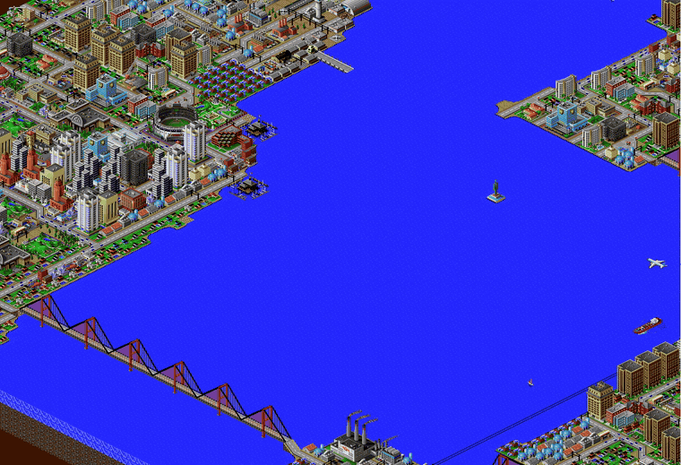
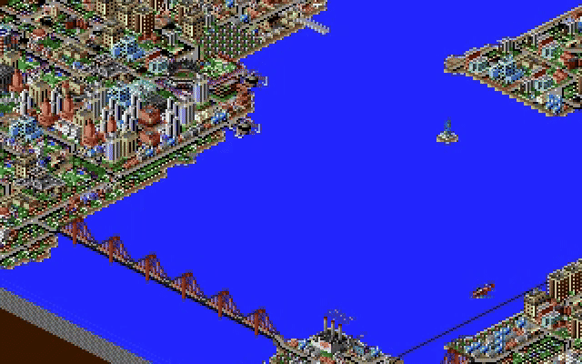
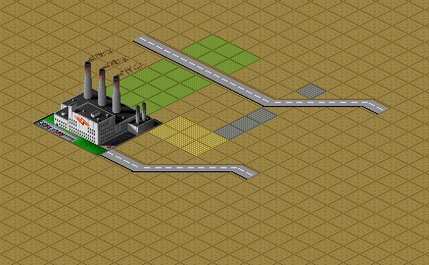
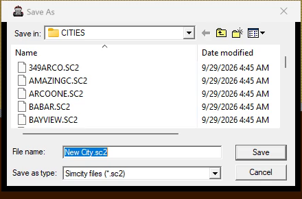

# SimCity 2000 — Static Recompilation



Static recompilation of **SimCity 2000** (Maxis, Windows 95 edition, `SIMCITY.EXE`
built 1996-03-07) from its shipping binary to native C. Every function in the
game — the simulation, the isometric renderer, and the statically linked MFC
and C runtime — is lifted to C and compiled into a new Windows program. No
emulator.

Built on the [pcrecomp](https://github.com/sp00nznet/pcrecomp) toolchain and
following its shared house style for recompilation projects.

**Generated source is not distributed.** You supply your own copy of the game;
the lifter runs on your machine and writes the C into a gitignored folder.

## Status

**v0.3.0 — alpha. It plays: build a city, save it, load it, watch it animate.**

The recompiled program generates maps, takes building tools (power plants,
zones, roads), saves and loads cities through the game's own File dialogs,
and animates its palette on a 32-bit desktop. Checked against the original:
the same saved city, run for the same time in the original `SIMCITY.EXE` and
in the recompiled one, ends with the same funds to the dollar, and a city saved
by the recompiled game loads in the original. Everything on screen below is
the game's own code, recompiled.

| | |
|---|---|
|  |  |
| Title screen and main menu | Start New City: a generated map |
|  |  |
| February 1900: toolbar up, "Power Plant Needed" | `CITIES\NYC.SC2`, loaded and simulating |
|  |  |
| Palette animation, emulated on a 32-bit desktop | A coal plant, zones and roads, placed with the tools |
|  | |
| File > Save City As, in today's common dialog | |

| Area | State |
|---|---|
| Lift | 7,045 functions, 0 lift errors, ~522K lines of C |
| Startup, MFC, dialogs, menus, toolbar | Working |
| Terrain generation, map rendering | Working |
| Building: power plants, power lines, zones, roads | Working |
| Simulation | Matches the original: same save, same funds after the same run |
| Save City As, Load City (File dialogs) | Working, with a compatibility fix the original also needs |
| Loading a city from the command line | Working |
| Palette animation (traffic, lights) | Working: the host emulates a 256-colour palette display |
| Intro movie | Skipped — the game looks for the CD, and says so |
| Sound and music | Working in play (not checked by the headless runs) |
| Frontend window: filters, glow, CRT, menu bar, cheats, turbo | Working (the default; `--classic` for the game's own windows) |
| Save slots, mods (built-in and DLL) | Working |
| Speed | Measured a month behind the original over five minutes, on a machine that was saturated by other builds at the time — to be re-measured |

Needs two pcrecomp fixes that are in review: pcrecomp#6 (`lift32` narrow
`mul`/`div`: without it the simulation faults when the first newspaper closes)
and pcrecomp#8 (a `rep` compare with ECX = 0: without it the simulation hangs
in `strstr`). Build against a pcrecomp checkout that has both, via `PCRECOMP`
(below).

## Getting Started

You need the **Windows 95** version of SimCity 2000: the *CD Collection* or
*Special Edition* disc, which has a `WIN95\SC2K` folder with `SIMCITY.EXE` in it.
(The DOS and Windows 3.1 versions are different programs and are not supported.)

### Step by step

Prerequisites, all on Windows 10 or 11:

- Visual Studio 2022 or Build Tools 2022, with the **x86** C++ libraries
- LLVM 17 or newer (for `clang-cl`), CMake 3.20+, Ninja
- Python 3.11+ with `capstone` and `pefile` (`py -3 -m pip install capstone pefile`)
- IDA Pro 9.x with idalib, for the function catalog (see [ROADMAP](ROADMAP.md))
- ffmpeg on `PATH`, only for `--record`
- A checkout of [pcrecomp](https://github.com/sp00nznet/pcrecomp) with #6 and
  #8, either next to this one (`..\tools`) or anywhere, named by the
  `PCRECOMP` environment variable (both `run_lift.py` and `tools\build.cmd`
  read it). Until they merge, make one from the two PR branches:
  ```
  git -C ..\tools fetch origin
  git -C ..\tools worktree add ..\simcity2000\work\pcrecomp origin/fix/lift32-narrow-muldiv
  git -C work\pcrecomp merge origin/fix/lift32-rep-ecx0-flags
  set PCRECOMP=%CD%\work\pcrecomp
  ```
  The merge stops on `CHANGELOG.md` and `tools/lift/difftest.py`; both sides
  are additions, so keep both and `git commit`.

1. Copy the disc's `WIN95\SC2K` folder into `game\`, so that
   `game\SIMCITY.EXE` exists.
2. Build the function catalog and code map with IDA (about a minute):
   ```
   copy game\SIMCITY.EXE work\ida_SIMCITY.EXE
   py -3.11 ..\tools\tools\ida\ida_funcs.py  work\ida_SIMCITY.EXE analysis\ida_funcs.json
   py -3.11 ..\tools\tools\ida\ida_export.py work\ida_SIMCITY.EXE analysis\ida_codemap.json --key va
   ```
   Expected: `5205 functions (library=1422, thunks=1893, ...)` and
   `191512 code heads`.
3. Lift:
   ```
   py -3 run_lift.py
   ```
   Expected: `functions 7045   errors 0   files 18   lines 522,xxx`.
4. Build: `tools\build.cmd`. Expected: `build\sc2k.exe`, about 7 MB.
5. Run: `build\sc2k.exe game\SIMCITY.EXE`. The first line is
   `[host] ...\SIMCITY.EXE mapped at 0x00400000, 7045 lifted functions, 0 unresolved imports`.

Usual trip-ups: `py` vs `python` (use the `py` launcher; the Microsoft Store
`python` alias is not a real interpreter), and a `PATH` change that needs a new
terminal. `tools\build.cmd` sets up the Visual Studio environment itself.

A one-click `Setup.cmd` quick start is on the [roadmap](ROADMAP.md).

## Usage

```
build\sc2k.exe [--headless] [--record out.mp4] [--fps N] [--seconds N]
               [--input SCRIPT] [--native] [path\to\SIMCITY.EXE] [game arguments...]
```

- `--headless` runs the game on a private desktop: it runs and paints, but
  nothing appears on your screen. Works over RDP. The game's frame is a fixed
  1600×960 there, so scripted coordinates do not depend on your resolution.
- `--record out.mp4` films every window of the game through ffmpeg.
- `--seconds N` exits after N seconds.
- Anything after the game's path goes to the game; a city file opens that
  city: `build\sc2k.exe game\SIMCITY.EXE CITIES\NYC.SC2`.
- The game plays in the host's own window by default (the frontend): shader
  filters, glow, CRT, and a menu bar with the game's menus plus Graphics,
  Effects, Play (turbo, wheel zoom, autosave), Display, Debug and Cheats
  (docs/frontend.md). `--classic` shows the game's own windows instead.
- Mods: built-in and DLL mods with a small C API (docs/mods.md);
  `SC2K_MODS="Always sunny,City stipend"` switches them on without the menu.
- `--native` runs the **original** `SIMCITY.EXE` instead, on the same desktop
  with the same recorder and script: the reference to compare against.
- `--input SCRIPT` plays scripted input, `T:verb args` separated by `;`, with T
  in seconds: `click X,Y`, `press X,Y,MS` (hold, for a tool's variants menu),
  `drag X1,Y1,X2,Y2` (zones, roads), `key VK`, `type TEXT`, `command ID` (a menu
  item, e.g. `0x8026` Save City As, `0x8021` Load City), and `wait TITLE` (until
  a window with that title shows; later steps count from then).

Save the current city as TESTCITY, headless:

```
build\sc2k.exe --headless --seconds 60 ^
    --input "35:command 0x8026; 36:wait Save As; 38:type TESTCITY; 40:key 13" ^
    game\SIMCITY.EXE game\DEFAULT.SC2
```

Diagnostics, as environment variables: `SC2K_APITRACE=1` logs every Win32 call
by name; `SC2K_CBTRACE=1` every call from Windows into the game;
`SC2K_WATCH=1` prints where the guest is once a second; `SC2K_REGTRACE=1` logs
registry access; `SC2K_CAPTRACE=1` lists the game's windows during a recording.

Settings live where the game always kept them, under
`HKEY_CURRENT_USER\Software\Maxis\SimCity 2000`. On first run the host fills in
what the installer would have written, without overwriting anything present.

## How it works

[docs/architecture.md](docs/architecture.md) covers the design: the game image is
mapped at its original address, its imports are bound to the real Win32 API,
and callbacks from Windows into the game are caught with a DEP trap.
[docs/bringup-notes.md](docs/bringup-notes.md) has the problems that took the
longest to find, and [docs/effects.md](docs/effects.md) the optional effects, and
[docs/frontend.md](docs/frontend.md) the frontend window.

## Building from source

See *Step by step* above. `run_lift.py` and `CMakeLists.txt` document each step.

## License

MIT — see [LICENSE](LICENSE). This covers the code in this repository only.
SimCity 2000 is © Maxis / Electronic Arts; no game code or data is included.
