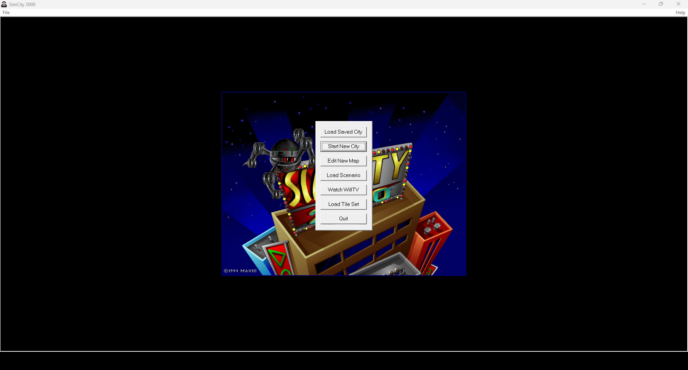
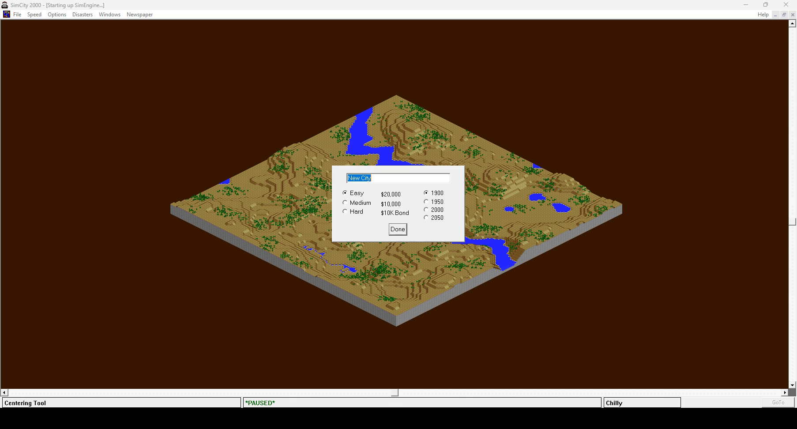
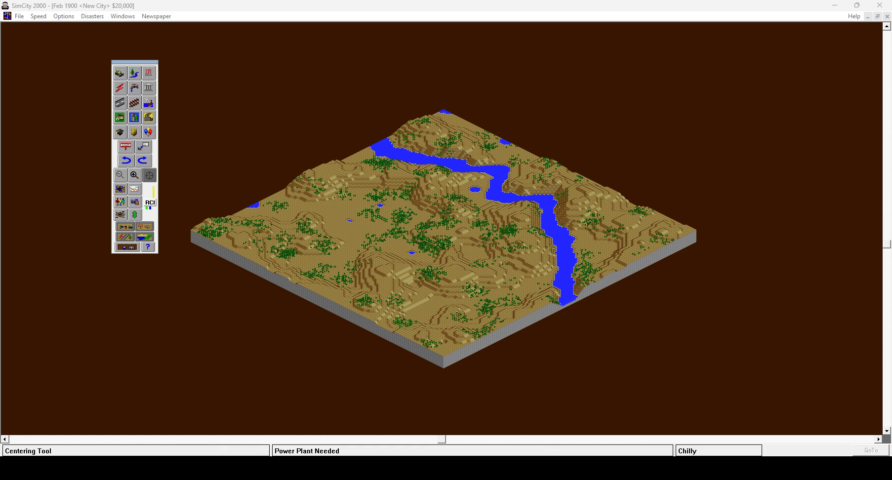
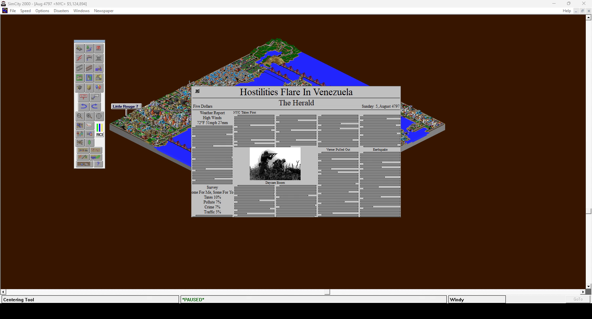

# SimCity 2000 — Static Recompilation

Static recompilation of **SimCity 2000** (Maxis, Windows 95 edition, `SIMCITY.EXE`
built 1996-03-07) from its shipping binary to native C. Every function in the
game — the simulation, the isometric renderer, and the statically linked MFC
and C runtime — is lifted to C and compiled into a new Windows program. No
emulator.

Built on the [pcrecomp](https://github.com/sp00nznet/pcrecomp) toolchain and
following its shared house style for recompilation projects.

**Generated source is not distributed.** You supply your own copy of the game;
the lifter runs on your machine and writes the C into a gitignored folder.

## Status

**v0.2.0 — alpha. It plays: new cities and saved ones, with the simulation running.**

The recompiled program runs the CRT and MFC startup, shows the title screen,
generates new maps, loads saved cities, and runs the simulation: NYC, left
running headless for 200 seconds, advanced a full game year with no fault and
no unresolved call. Everything on screen below is the game's own code,
recompiled.

| | |
|---|---|
|  |  |
| Title screen and main menu | Start New City: a generated map |
|  |  |
| February 1900: toolbar up, "Power Plant Needed" | `CITIES\NYC.SC2`, loaded and simulating |

| Area | State |
|---|---|
| Lift | 7,045 functions, 0 lift errors, ~522K lines of C |
| Startup, MFC, dialogs, menus, toolbar | Working |
| Terrain generation, map rendering | Working |
| Loading a saved city (from the command line) | Working |
| Simulation | Runs: a full year of NYC, no faults |
| Building with the tools | Not yet exercised |
| Palette animation (water, lights) | Not emulated: modern desktops are 32-bit colour |
| Intro movie | Skipped — the game looks for the CD, and says so |
| Sound and music | Not yet exercised |
| Saving | Not yet exercised |

Needs pcrecomp with the `lift32` narrow `mul`/`div` fix (pcrecomp#6, branch
`fix/lift32-narrow-muldiv`); without it the simulation faults as soon as the
first newspaper closes.

## Getting Started

You need the **Windows 95** version of SimCity 2000: the *CD Collection* or
*Special Edition* disc, which has a `WIN95\SC2K` folder with `SIMCITY.EXE` in it.
(The DOS and Windows 3.1 versions are different programs and are not supported.)

### Step by step

Prerequisites, all on Windows 10 or 11:

- Visual Studio 2022 or Build Tools 2022, with the **x86** C++ libraries
- LLVM 17 or newer (for `clang-cl`), CMake 3.20+, Ninja
- Python 3.11+ with `capstone` and `pefile` (`py -3 -m pip install capstone pefile`)
- IDA Pro 9.x with idalib, for the function catalog (see [ROADMAP](ROADMAP.md))
- ffmpeg on `PATH`, only for `--record`
- A checkout of [pcrecomp](https://github.com/sp00nznet/pcrecomp) next to this
  one (`..\tools`), or `-DPCRECOMP=<path>` when configuring

1. Copy the disc's `WIN95\SC2K` folder into `game\`, so that
   `game\SIMCITY.EXE` exists.
2. Build the function catalog and code map with IDA (about a minute):
   ```
   copy game\SIMCITY.EXE work\ida_SIMCITY.EXE
   py -3.11 ..\tools\tools\ida\ida_funcs.py  work\ida_SIMCITY.EXE analysis\ida_funcs.json
   py -3.11 ..\tools\tools\ida\ida_export.py work\ida_SIMCITY.EXE analysis\ida_codemap.json --key va
   ```
   Expected: `5205 functions (library=1422, thunks=1893, ...)` and
   `191512 code heads`.
3. Lift:
   ```
   py -3 run_lift.py
   ```
   Expected: `functions 7045   errors 0   files 18   lines 522,xxx`.
4. Build: `tools\build.cmd`. Expected: `build\sc2k.exe`, about 7 MB.
5. Run: `build\sc2k.exe game\SIMCITY.EXE`. The first line is
   `[host] ...\SIMCITY.EXE mapped at 0x00400000, 7045 lifted functions, 0 unresolved imports`.

Usual trip-ups: `py` vs `python` (use the `py` launcher; the Microsoft Store
`python` alias is not a real interpreter), and a `PATH` change that needs a new
terminal. `tools\build.cmd` sets up the Visual Studio environment itself.

A one-click `Setup.cmd` quick start is on the [roadmap](ROADMAP.md).

## Usage

```
build\sc2k.exe [--headless] [--record out.mp4] [--fps N] [--seconds N]
               [--input SCRIPT] [path\to\SIMCITY.EXE] [game arguments...]
```

- `--headless` runs the game on a private desktop: it runs and paints, but
  nothing appears on your screen. Works over RDP.
- `--record out.mp4` films every window of the game through ffmpeg.
- `--seconds N` exits after N seconds.
- Anything after the game's path goes to the game; a city file opens that
  city: `build\sc2k.exe game\SIMCITY.EXE CITIES\NYC.SC2`.
- `--input "22:click 902,384; 34:click 901,519"` posts clicks (and `T:key VK`
  key presses) at the given times — how the screenshots above were taken:

```
build\sc2k.exe --headless --record city.mp4 --seconds 70 ^
    --input "22:click 902,384; 34:click 901,519" game\SIMCITY.EXE
```

Diagnostics, as environment variables: `SC2K_APITRACE=1` logs every Win32 call
by name; `SC2K_WATCH=1` prints where the guest is once a second;
`SC2K_REGTRACE=1` logs registry access; `SC2K_CAPTRACE=1` lists the game's
windows during a recording.

Settings live where the game always kept them, under
`HKEY_CURRENT_USER\Software\Maxis\SimCity 2000`. On first run the host fills in
what the installer would have written, without overwriting anything present.

## How it works

[docs/architecture.md](docs/architecture.md) covers the design: the game image is
mapped at its original address, its imports are bound to the real Win32 API,
and callbacks from Windows into the game are caught with a DEP trap.
[docs/bringup-notes.md](docs/bringup-notes.md) has the problems that took the
longest to find.

## Building from source

See *Step by step* above. `run_lift.py` and `CMakeLists.txt` document each step.

## License

MIT — see [LICENSE](LICENSE). This covers the code in this repository only.
SimCity 2000 is © Maxis / Electronic Arts; no game code or data is included.
