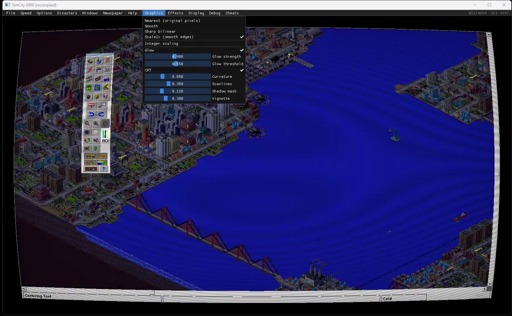

# The frontend

`sc2k --frontend` plays the game in the host's own window instead of the game's:
the picture goes through a shader chain, and a menu bar sits above it that never
covers the game (after Tachyon's developer bar).



**Turbo** (`qol.c`): the game paces its simulation with one 200 ms
`timeSetEvent`; turbo shortens the period. Measured on NYC: 40 game days in 8 s
at normal speed, 161 at 4x. The mouse wheel sends the toolbar's own zoom
commands (`0x20` in, `0x21` out). Autosave sends File > Save City (`0x8025`)
only for a city that already has a file, so it never opens a dialog.

## How it fits together

```
 game thread (headless desktop)           frontend (your desktop)
 ------------------------------           -----------------------
 SIMCITY.EXE, recompiled                  src/frontend/frontend.cpp
   draws with GDI                           Direct3D 11 + Dear ImGui
        |                                        ^           |
        v                                        |           | your mouse and keys
 frame.c  PrintWindow of the main  ---frames-----+           v
          frame's client area and                     input.c  live queue ->
          every other visible window                  worker on the game's desktop
          of the game, composited                     posts to the window under the
                                                      point; synthetic cursor state
```

- **The picture** (`frame.c`): the main frame's client area, with dialogs,
  floating palettes and pop-ups laid over it. Plain `PrintWindow` (WM_PRINT) --
  13-25 ms a frame for the city view, where the full-content path took 26-98 ms.
  `SC2K_CAPMODE=full` switches back.
- **Input** (`input.c`): the frontend maps a point in its window back to the
  picture and queues it. A worker on the game's desktop hit-tests, keeps the
  window that got the button down until release (as mouse capture would), and
  keeps the synthetic cursor the game's drag code reads in step. Keys go to the
  game thread's focus window; modifier state is read from the hardware, since
  the game thread never sees the real keyboard.
- **Menus**: the game's own menu bar is mirrored from its `HMENU` on every
  frame. Opening one sends the game `WM_INITMENUPOPUP` first, so MFC updates
  its check marks and greying exactly as it would for a real menu; choosing an
  item sends `WM_COMMAND`. The toolbar's variant pop-ups (`TrackPopupMenu`) are
  shown as ImGui pop-ups, because a real one would open on a desktop nobody can
  see; the game thread waits for the choice.
- **Cursor**: the game's `SetCursor` is recorded and shown over the picture.

## The menus

| Menu | What it has |
|---|---|
| File ... Help | The game's own, mirrored |
| Graphics | Filter: nearest, smooth, sharp bilinear, Scale2x; integer scaling; glow; CRT (curvature, scanlines, shadow mask, vignette) |
| Effects | Day and night, seasons, weather (docs/effects.md); days per cycle; night depth |
| Play | Turbo on top of the game's speed (2x, 4x, 8x); mouse wheel zoom; autosave every 5, 10 or 30 minutes |
| Display | Fullscreen (F11), vsync |
| Debug | City stats window; capture time and frame rate |
| Cheats | Add funds; hold funds where they are |

Settings are saved to `sc2k.ini` beside `sc2k.exe`.

The glow is a bright pass weighted by saturation, blurred at half size: the
city's coloured lights bloom, and the game's white dialogs do not.

## Testing it without a mouse

`SC2K_UISCRIPT="T:click X,Y; T:move X,Y; T:key VK"` posts input to the frontend
window itself (client coordinates), which is how the menu bar is checked in a
recording. At the console, run it on a virtual monitor with
[offstage](https://github.com/sp00nznet/offstage):

```
offstage run --size 1920x1080 --record out.mp4 -- ^
    build\sc2k.exe --frontend --seconds 45 game\SIMCITY.EXE game\CITIES\NYC.SC2
```
